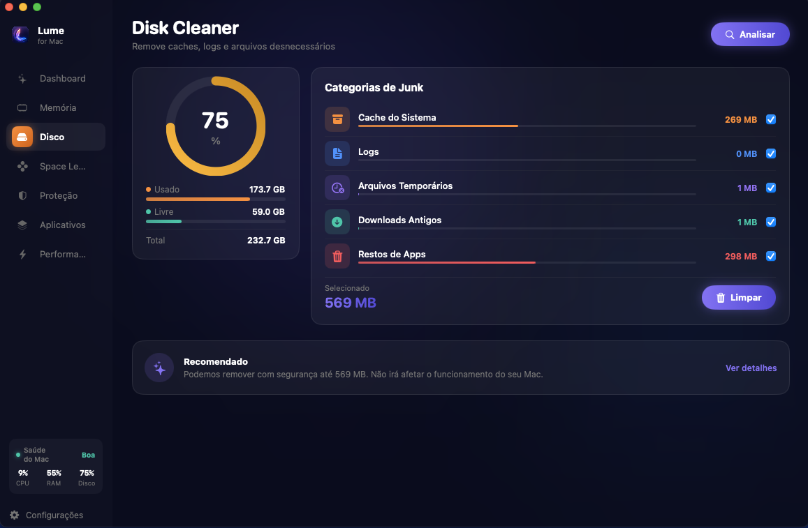
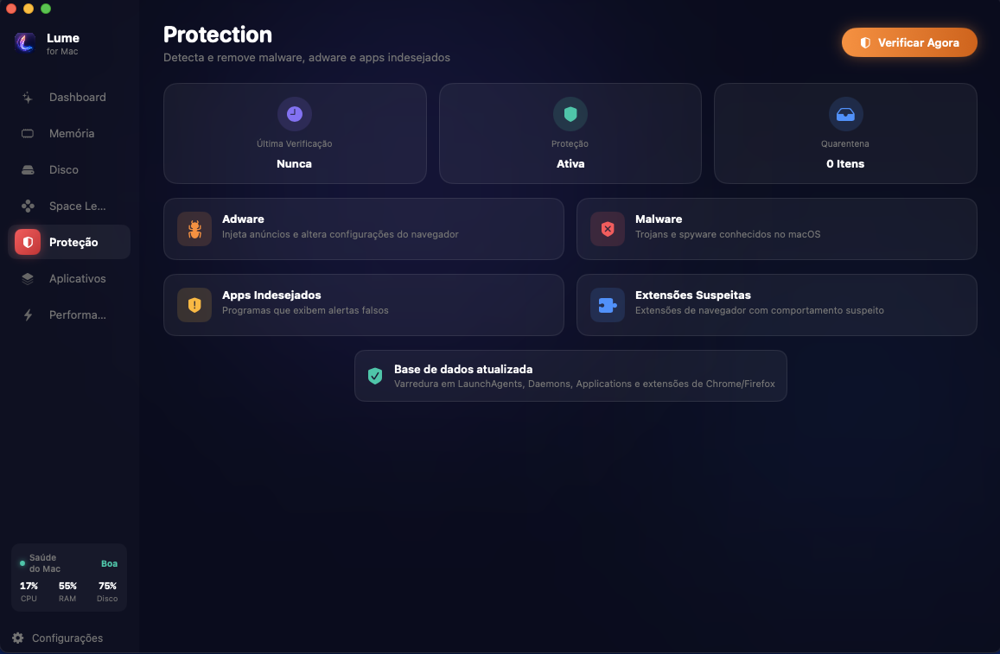

<div align="center">


# Lume

**The free, native alternative to paid cleanup apps for macOS, Windows and Linux.**

[](#downloads)
[](LICENSE)
[](#)
[](#)
[](#support)

**[getlu.me](https://getlu.me)**

[English](README.md) · [Português](README.pt-BR.md)

</div>

---

Lume is a lightweight, native cleanup utility that does everything paid apps like CleanMyMac do — disk cleanup, memory optimization, malware detection, app management, large-file discovery, performance tuning — without the subscription, the account, the ads, or the bloat.

The macOS build is **~5 MB universal** (Apple Silicon + Intel). Windows and Linux builds are similarly small.

<div align="center">
  
</div>

## Features

| Module | What it does |
|---|---|
| 🟣 **Smart Scan / Dashboard** | Real-time CPU, RAM and disk gauges with instant system health diagnostics |
| 🔵 **Memory Cleaner** | Frees RAM held by inactive processes via native OS calls |
| 🟠 **Disk Cleanup** | Removes caches, logs, temp, old downloads, Trash and orphaned app data — always via Trash, recoverable |
| 🟢 **Space Lens** | Finds the largest files and folders across every mounted disk, with type and size filters |
| 🔴 **Protection** | Detects known adware, PUPs and malware across LaunchAgents, system services, /Applications and browser extensions |
| 🟢 **Applications** | Lists installed apps with sizes and last-used dates, uninstalls with their support files |
| 🟡 **Performance** | DNS flush, search-index reindex, font cache clear, Trash emptying, Launch Agent toggle/remove |
| 🟣 **Menu Bar / System Tray** | Quick panel with live metrics + one-click memory clean — no need to open the main window |

## Downloads

<div align="center">

| Platform | Format | File |
|---|---|---|
| 🍎 **macOS** 13+ | `.pkg` Universal (Apple Silicon + Intel) | [Lume_Installer.pkg](https://github.com/hasencleverw/get-lume-app/releases/latest) |
| 🪟 **Windows** 10/11 | `.exe` Installer (NSIS) · `.zip` Portable | [Lume_x64-setup.exe](https://github.com/hasencleverw/get-lume-app/releases/latest) |
| 🐧 **Linux** | `.deb` Debian/Ubuntu · `.rpm` Fedora · `.pkg.tar.zst` Arch | [Choose your distro](https://github.com/hasencleverw/get-lume-app/releases/latest) |

</div>

> **Heads up — Beta:** Lume is currently signed ad-hoc (no Apple Developer ID). On first launch, macOS may show a Gatekeeper warning. Right-click the app → **Open**, or run `sudo xattr -dr com.apple.quarantine /Applications/Lume.app` once.

## Screenshots

<table>
<tr>
<td width="50%"></td>
<td width="50%"></td>
</tr>
<tr>
<td align="center"><b>Disk Cleanup</b> — categorized junk, all safe-to-Trash</td>
<td align="center"><b>Space Lens</b> — find the biggest files on any disk</td>
</tr>
<tr>
<td width="50%"></td>
<td width="50%"></td>
</tr>
<tr>
<td align="center"><b>Protection</b> — 4-layer threat scan</td>
<td align="center"><b>Smart Scan</b> — live system health</td>
</tr>
</table>

## Why Lume vs the paid alternatives?

|  | Lume | Paid cleanup apps |
|---|:---:|:---:|
| Price | **Free forever** | US$ 40–80 / year |
| App size | ~5 MB | ~300 MB |
| Account required | No | Yes |
| Data collection | No | Yes (anonymous) |
| Supported systems | macOS · Windows · Linux | macOS only |
| Source available | ✅ Elastic License 2.0 | ❌ |
| Languages | PT · EN · ES | EN + |

## Architecture

Lume is built natively per platform for the best UX and the smallest binary:

```
                       ┌─────────────────────────┐
                       │   Shared service        │
                       │   architecture          │
                       └────────────┬────────────┘
                                    │
            ┌───────────────────────┴───────────────────────┐
            │                                               │
    ┌───────▼─────────┐                ┌────────────────────▼─┐
    │   macOS         │                │   Windows + Linux    │
    │   Swift 6 +     │                │   Tauri 2 +          │
    │   SwiftUI +     │                │   Rust +             │
    │   SPM           │                │   Svelte 5           │
    └─────────────────┘                └──────────────────────┘
```

This repository hosts both the **macOS** reference (`macos/`, Swift 6 / SwiftUI / SPM) and the **Windows + Linux** port (`windows-linux/`, Tauri 2 / Rust + Svelte 5) — a 1:1 mirror of the Swift services. Installer artifacts are attached to the [Releases page](https://github.com/hasencleverw/get-lume-app/releases).

### macOS source layout

```
macos/
├── Package.swift                — SPM manifest
├── build.sh                     — builds universal .app + .dmg + .pkg
├── installer/                   — PKG installer pages (welcome / EULA / conclusion)
└── Lume/
    ├── LumeApp.swift            — @main + AppDelegate + MenuBarExtra
    ├── ContentView.swift        — sidebar + section routing
    ├── Models/                  — enums and design tokens
    ├── Services/                — pure logic (no UI)
    │   ├── SystemMonitor.swift           — CPU/RAM/disk stats, purge
    │   ├── DiskScanner.swift             — junk categories + safety policies
    │   ├── LargeFilesScanner.swift       — Space Lens engine
    │   ├── MalwareScanner.swift          — 4-layer threat detection
    │   ├── AppManager.swift              — app discovery + privileged uninstall
    │   ├── PermissionsManager.swift      — Full Disk Access detection
    │   ├── PrivilegedExecutor.swift      — sudo -S session cache
    │   ├── DonationManager.swift         — HMAC-SHA256 donor key
    │   ├── Localization.swift            — 220+ keys in PT/EN/ES
    │   └── …
    ├── Views/                   — SwiftUI per-section views
    └── Resources/               — Icons, sounds, Info.plist
```

### Windows + Linux source layout

Windows and Linux share a single Tauri 2 codebase. The Rust service layer is a 1:1 port of the Swift reference — every module under `Lume/Services/` maps to a Rust file under `windows-linux/src-tauri/src/services/`.

```
windows-linux/
├── package.json                  — SvelteKit + Tauri CLI deps
├── svelte.config.js
├── vite.config.ts
├── tsconfig.json
│
├── src/                          — UI (SvelteKit, shared Windows + Linux)
│   ├── app.html
│   ├── app.d.ts
│   ├── lib/                      — components, stores, design tokens
│   └── routes/                   — per-section views
│
└── src-tauri/
    ├── Cargo.toml
    ├── tauri.conf.json           — bundles: nsis + msi (Windows), deb + rpm + appimage (Linux)
    ├── build.rs
    ├── capabilities/             — Tauri v2 permission grants
    ├── icons/                    — .ico (Windows), .png (Linux), NSIS installer images
    └── src/
        ├── main.rs / lib.rs / state.rs / tray.rs
        ├── commands/             — JS ↔ Rust bridge (one file per feature)
        │   ├── apps.rs
        │   ├── disk.rs
        │   ├── memory.rs
        │   ├── large_files.rs
        │   ├── protection.rs
        │   ├── performance.rs
        │   ├── system.rs
        │   ├── donation.rs
        │   └── updater.rs
        ├── services/             — pure logic (1:1 mirror of macOS/Lume/Services/)
        │   ├── system_monitor.rs        — CPU/RAM/disk stats
        │   ├── disk_scanner.rs          — junk categories + safe trash
        │   ├── large_files.rs           — Space Lens engine
        │   ├── protection.rs            — 4-layer threat detection
        │   ├── app_manager.rs           — app discovery + uninstall
        │   ├── memory_cleaner.rs        — frees RAM via OS calls
        │   ├── performance.rs           — DNS flush, caches, indexes
        │   ├── donation.rs              — HMAC-SHA256 donor key
        │   └── updater.rs               — release channel check
        └── platform/             — OS-specific implementations
            ├── mod.rs            — #[cfg(target_os)] dispatcher
            ├── windows.rs        — Win32 / WMI / Registry / NTAPI
            └── linux.rs          — procfs / D-Bus / systemd / gio
```

### Service mapping (Swift ↔ Rust)

The Tauri port preserves the macOS service layer 1:1. Bug fixes in the Swift reference inform Rust changes and vice-versa.

| macOS (Swift) | Windows + Linux (Rust) | What it does |
|---|---|---|
| `Services/SystemMonitor.swift` | `services/system_monitor.rs` + `services/memory_cleaner.rs` | CPU / RAM / disk stats + `purge` |
| `Services/DiskScanner.swift` | `services/disk_scanner.rs` | Junk categories + safety policies |
| `Services/LargeFilesScanner.swift` | `services/large_files.rs` | Space Lens engine |
| `Services/MalwareScanner.swift` | `services/protection.rs` | 4-layer threat detection |
| `Services/AppManager.swift` | `services/app_manager.rs` | App discovery + uninstall |
| `Services/PermissionsManager.swift` | `services/permissions.rs` *(in progress)* | Privilege / capability detection |
| `Services/PrivilegedExecutor.swift` | `services/privileged.rs` *(in progress)* | Elevated session cache |
| `Services/DonationManager.swift` | `services/donation.rs` | HMAC-SHA256 donor key |
| `Services/UpdaterService.swift` | `services/updater.rs` | GitHub Releases polling (≤ 1×/week, no auto-install) |
| `Services/Localization.swift` | SvelteKit `i18n` + locale files | 220+ keys in PT / EN / ES |

## Build from source (macOS)

Requirements: **macOS 13+**, **Xcode Command Line Tools** (Swift 5.9+).

```bash
git clone https://github.com/hasencleverw/get-lume-app.git
cd lume-app/macos

# Debug build (current arch only)
swift build

# Full release: universal .app + .dmg + .pkg
bash build.sh release
```

The release script produces:

- `macos/Lume_Installer.pkg` — signed installer
- `macos/Lume.dmg` — drag-and-drop disk image
- `/tmp/LumeApp/Lume.app` — universal binary (arm64 + x86_64)

## Build from source (Windows + Linux)

Requirements: **Rust 1.75+**, **Node.js 20+**, **npm 10+** (or pnpm).
On Linux also install the system libraries Tauri needs:

```bash
sudo apt install libwebkit2gtk-4.1-dev libssl-dev libgtk-3-dev \
                 libayatana-appindicator3-dev librsvg2-dev
```

```bash
git clone https://github.com/hasencleverw/get-lume-app.git
cd lume-app/desktop
npm ci

# Dev (current OS, hot reload)
npm run tauri dev

# Windows release: Lume-Setup.exe (NSIS) + Lume.msi
npm run tauri build -- --target x86_64-pc-windows-msvc

# Linux release: .AppImage + .deb + .rpm
npm run tauri build
```

The release builds are placed under `windows-linux/src-tauri/target/release/bundle/`:

- **Linux** → `appimage/Lume_*.AppImage` · `deb/Lume_*_amd64.deb` · `rpm/Lume-*.x86_64.rpm`
- **Windows** → `nsis/Lume-Setup-*.exe` · `msi/Lume_*.msi`

CI builds for both platforms run via [`.github/workflows/desktop-release.yml`](.github/workflows/desktop-release.yml) on every `v*` tag.

## Contributing

Pull requests welcome. For non-trivial changes please open an issue first to discuss the direction.

Areas where help is wanted:

- **Localization** — adding French, German, Italian, Mandarin, Japanese
- **Threat database** — verified additions to the malware list in `MalwareScanner.swift`
- **Apple Developer ID signing** — sponsoring the US$ 99/year for proper notarization
- **Linux distro packaging** — AUR PKGBUILD, Flathub manifest, Snap recipe

## Support

Lume is built by a single developer who pays for everything himself. If the app saves you the cost of a paid cleanup subscription, please consider supporting the project:

| Method | Where |
|---|---|
| 🇧🇷 PIX | `95c1adaf-d8ee-4498-b7af-3a810ae30b59` |
| 🌎 PayPal | `hasen.borges@gmail.com` |
| ⭐ Star | the easiest one — give this repo a star |

After donating, email a receipt to **hasen.borges@gmail.com** and you'll receive a donor key that permanently disables in-app reminders.

## License

[Elastic License 2.0](LICENSE) © 2026 Hasen Borges
